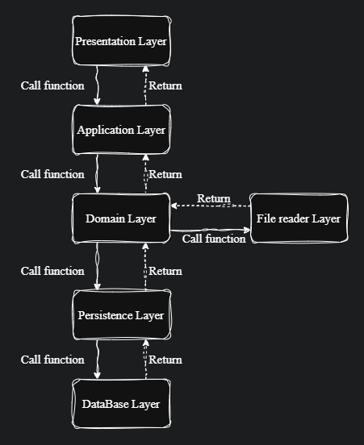

# 📦 Swift Code Manager

## 🌟 Content
- [Overwiev](#ℹ-overview)
- [Task Understanding](#-task-understanding)
- [Architecture & Description](#-architecture--description)
- [Setup](#setup)
- [Running](#-running)
- [Verification](#verification)
- [Testing](#-testing)


## ℹ️ Overview

This application parses SWIFT codes from an Excel spreadsheet, stores them in a database, and presents them to users via a clean, RESTful API. On first startup, it automatically imports every code from the provided Excel file so that they’re immediately available for querying and management.


## 📄 Task Understanding

Some parts of the exercise description were not clear for me. Here is how I chose to interpret them:

- > *“Codes can represent both the branch and the headquarter of the bank.”* 
    
    I understood this to mean that if a SWIFT code does not end with XXX and there is no headquarter for it, then that code should be treated as both a branch and headquarter.

- > *“Redundant columns in the file may be omitted.”*

    I interpreted this to mean that any columns in the source spreadsheet which are not required for the API responses or the application’s core processing logic can be omitted.


## 🛠️ Architecture & Description

<p align="center">
  
</p>

Although the structure may look like Domain‑Driven Design, my intention was to implement a Layered Architecture. As illustrated, the overall system is organized into six distinct layers:

1. **Presentation Layer**
    - Here I have everything related the REST API, such as controller class, dto, response and request objects. Also here as well as in the persistence layer I have mapper class for mapping `DTO ↔ domain` object

2. **Application Layer**
    - This layer is responsible for orchestrating whole application and performing validation on part which persistence and presentation layer aren't responsible for. It consists of two classes `"SwiftCodeManagerService"` and `"SwiftCodeInitializationService"`, where `"SwiftCodeInitializationService"` is responsible for startup initialization of the application.

3. **Domain Layer**
    - Has application’s domain-specific logic.

4. **File‑Reader Layer**
    - Responsible for reading the Excel spreadsheet stored in the resources folder, which contains the complete list of SWIFT codes.

5. **Persistence Layer**
    - Manages storing and retrieving SWIFT code entities in `PostgreSQL`, using `Spring Data JPA`.

6. **Database Layer**
    - A single PostgreSQL table `(swift_code)` with columns:

    ```postgres-sql
    swift_code_id             SERIAL PRIMARY KEY
    swift_code                VARCHAR(11)   UNIQUE NOT NULL
    bank_name                 VARCHAR(255)  NOT NULL
    address                   TEXT          NOT NULL
    country_iso2_code         CHAR(2)       NOT NULL
    country_name              VARCHAR(100)  NOT NULL
    headquarter_swift_code_id INTEGER       NULL REFERENCES swift_code(swift_code_id)
    ```
    Uses a self‑referencing foreign key (headquarter_swift_code_id) to link branches back to their headquarters, avoiding the need for separate tables.

## 🚧Setup
Clone the repository

```bash
git clone https://github.com/RocketSpace2/oleksii-oliinyk-swift-code-manager.git
```

## 🚀 Running

Docker Compose will start both Postgres and your Spring Boot app in one step:

```bash
docker-compose up --build
```

The **db** service will mount `./src/main/resources/init.sql` and initialize `docker_swift_code_manager_db` on first run.

The server service will:

- Build the `oleksii-oliinyk-swift-code-manager`

- Expose port `8080` on your host

- Automatically wire up to the `db` container

If you want to run in detached mode, run this command:

```bash
docker-compose up --build -d
```

If you’d like to run SpringBoot app locally, you can just pause the server service:

```bash
docker compose stop server
```
In this way db container will still run and it will be possible to connect to it from running localy.
To start container again run this command:
```bash
docker compose start server
```


## ✅Verification

Once the application is up and running, you can explore its key endpoints using Postman or any other HTTP client.

- To test the `POST` endpoint at `http://localhost:8080/v1/swift-codes`, send each of the following JSON payloads in a separate request.

  -

      ```json
      {
        "address": "456 Avenue des Champs‑Élysées, 75008 Paris",
        "bankName": "BANQUE PARISIENNE DE CRÉDIT",
        "countryISO2": "FR",
        "countryName": "France",
        "isHeadquarter": false,
        "swiftCode": "BPCRFRPP001"
      }
      ```
  -
      ```json
      {
        "address": "123 Rue de Rivoli, 75001 Paris",
        "bankName": "BANQUE PARISIENNE DE CRÉDIT",
        "countryISO2": "FR",
        "countryName": "France",
        "isHeadquarter": true,
        "swiftCode": "BPCRFRPPXXX"
      }
      ```
- Retrieve the details of one SWIFT code by supplying it in the URL path:

    ```
    http://localhost:8080/v1/swift-codes/BPCRFRPPXXX
    ```

- List every SWIFT code for a given country:
    ```
    http://localhost:8080/v1/swift-codes/country/FR
    ```
  
- Remove a SWIFT code entry by specifying it in the `DELETE` request:
    ```
    http://localhost:8080/v1/swift-codes/XYZABC12XXX
    ```
## 🔎 Testing

To run all of unit and integration tests in one go, simply execute:
```bash
mvn clean verify
```

